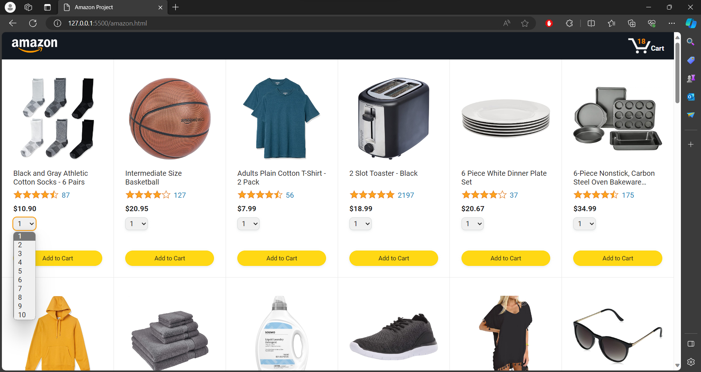
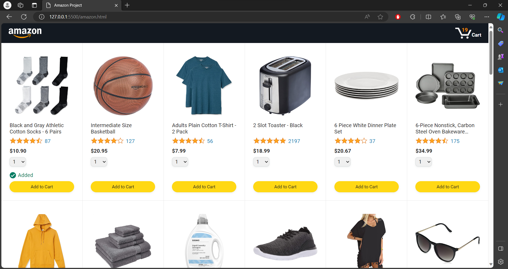
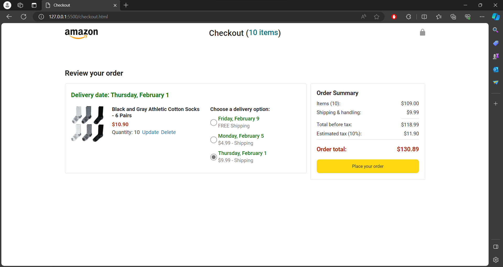
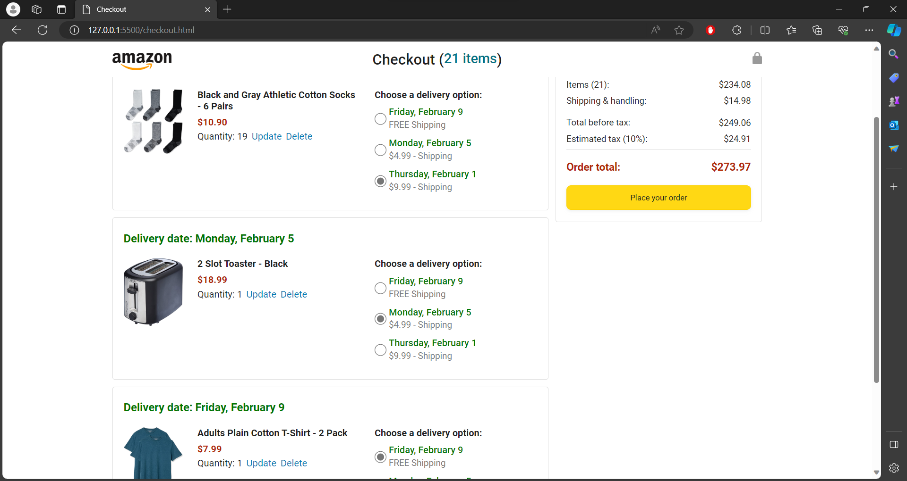

# Amazon Checkout Clone Project

## Overview

This project is a clone of the Amazon product display and checkout page, created using HTML, CSS, and JavaScript. It aims to replicate the basic user interface and functionality of the Amazon website.

## Features

- Product display with images, ratings, and prices.
- Add products to the shopping cart.
- Dynamic updating of the shopping cart.
- Overall Payment Summary for the items in cart including before and after tax.

## Technologies Used

- HTML5
- CSS3
- JavaScript

## Installation

1. Clone the repository:

   ```bash
   git clone https://github.com/your-username/amazon-clone.git

   ```

2. Navigate to the project directory in VS Code

3. Right click on the `amazon.html` and select 'Open with Live Server'.

4. This will open the project in your default web browser with Live Server, allowing you to see the Amazon product display and checkout page clone.

## Note:

`amazon.html` and `checkout.html` are working web pages for this project.
`order.html` and `tracking.html` are work in progress.

## Screenshots

Screenshots showcasing various features in the Amazon checkout project have been included:

1. **Amazon Products Display Page with Quantity Selector:**

   - Displaying multiple products with a quantity selector for each item.
     

2. **'Added' Text Message Timeout:**

   - Showing an 'Added' text message with a timeout when the "Add to Cart" button is clicked.
     

3. **Amazon Checkout Page:**

   - Overview of the Amazon checkout page layout.
     

4. **Update Quantity and Save Button Feature:**

   - Demonstrating the functionality to update the quantity of items and a save button on the checkout page.
     

5. **Delivery Option Change in Cart and Payment Summary:**

   - Illustrating the process of changing the delivery option in the cart and the corresponding update in the payment summary.
     

6. **Sample Cart with Different Products and Payment Summary:**
   - Displaying a sample cart with a variety of products and their payment summaries, showcasing the calculations before and after tax.
     
